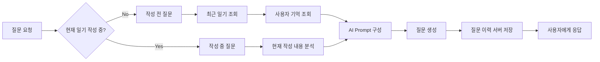
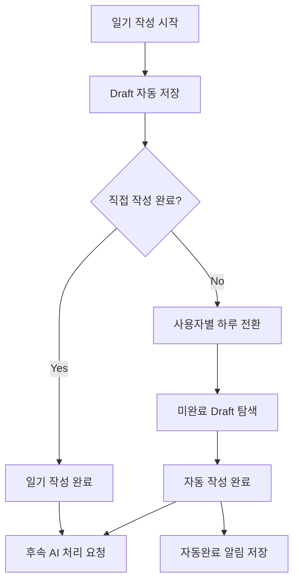
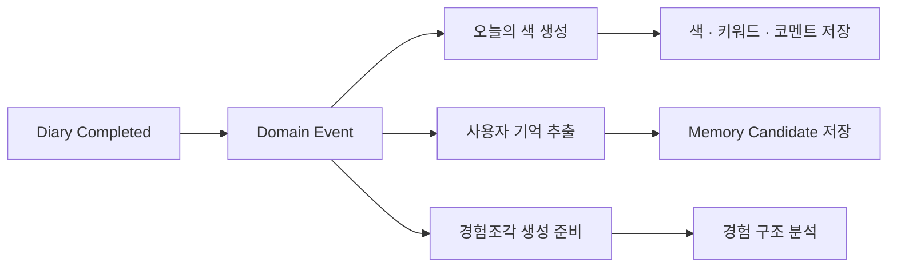
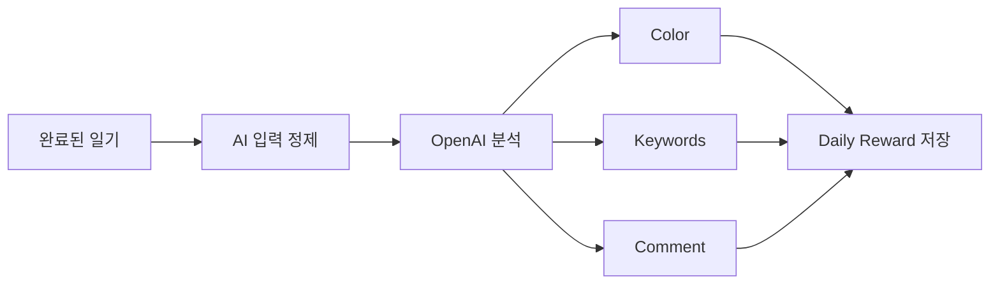
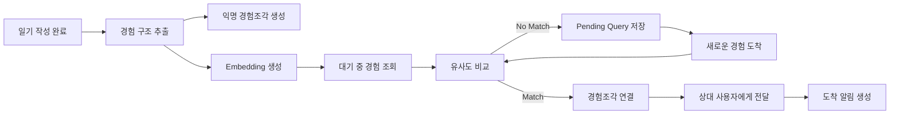
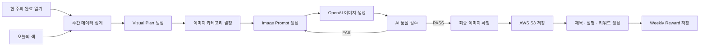
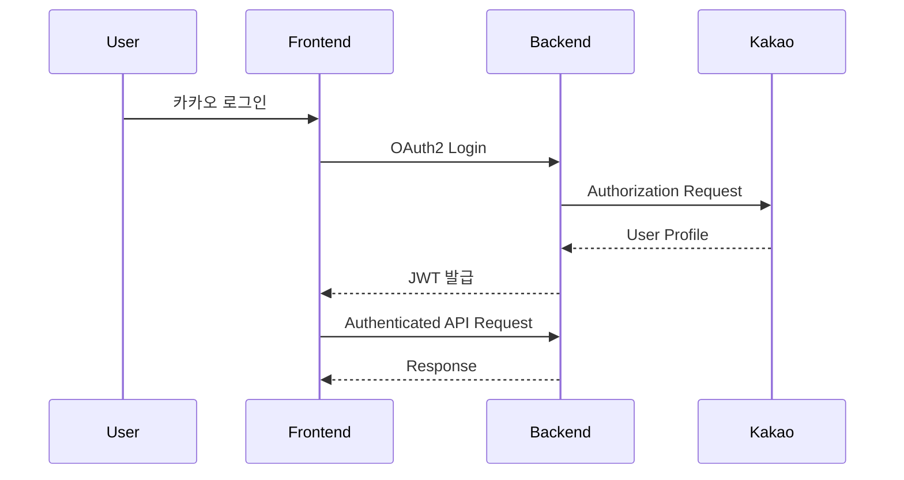
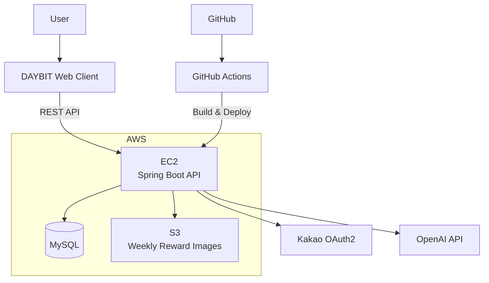
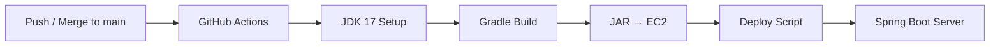

<div align="center">


# DAYBIT

### 기록을 부담 없이 시작하고, 하루를 색으로 남기며, 비슷한 경험과 이어지는 AI 일기 서비스

**멋쟁이사자처럼 14기 중앙 해커톤 · Team 오늘날씨맑음**

<br />

[](https://www.java.com/)
[](https://spring.io/projects/spring-boot)
[](https://www.mysql.com/)
[](https://aws.amazon.com/)
[](https://github.com/features/actions)
[](https://openai.com/)

<br />

**[서비스 바로가기](https://www.daybit.cloud)** ·
**[Frontend Repository](https://github.com/TEAM/FRONTEND-REPOSITORY)** ·
**[Backend Repository](https://github.com/ww123ok/mutsa-14th-aac-backend)** ·
**[API Docs](https://API-SERVER/swagger-ui/index.html)**

</div>

---

## 🌙 DAYBIT 소개

DAYBIT은 단순히 하루를 저장하는 데서 끝나는 일기 서비스가 아닙니다.

무엇을 써야 할지 막힐 때는 사용자의 현재 작성 상태와 이전 기록을 바탕으로 **AI 작성 도움 질문**을 제공하고, 일기를 완료하면 기록을 기반으로 **오늘의 색과 코멘트**를 생성합니다.

또한 일기에서 경험의 구조를 추출해 비슷한 경험을 가진 다른 사용자의 기록과 연결하는 **경험조각** 기능을 제공하며, 한 주 동안 쌓인 기록은 다시 하나의 **AI 주간 이미지 보상**으로 남습니다.

> **기록 → 성찰 → 연결 → 시각화**

---

## 📱 Service Preview

<div align="center">

<table>
  <tr>
    <td align="center"><b>홈 / 기록 캘린더</b></td>
    <td align="center"><b>오늘의 색</b></td>
    <td align="center"><b>주간 이미지 보상</b></td>
  </tr>
  <tr>
    <td></td>
    <td></td>
    <td></td>
  </tr>
</table>

<br />

<b>경험조각 도착</b>

<br /><br />


</div>

---

# 🖥 Backend

DAYBIT Backend는 단순 CRUD API를 넘어, **일기 작성 상태 관리 · AI 비동기 처리 · 사용자 기억 · 경험 매칭 · 이미지 생성 · 알림 · 인증 · 배포**까지 서비스의 핵심 흐름을 담당합니다.

## Backend at a Glance

| 영역 | 구현 내용 |
| --- | --- |
| **Diary Lifecycle** | 일기 임시저장, 작성 완료, 사용자별 하루 경계 처리, 미완료 일기 자동완료 |
| **AI Writing Help** | 작성 전/작성 중 상태 분리, 최근 일기·사용자 기억 기반 질문 생성, 질문 이력 서버 저장 |
| **Daily Reward** | 일기 내용을 정제한 뒤 AI로 오늘의 색·키워드·코멘트 생성 |
| **Reflection** | 일기 맥락 기반 성찰 질문 생성 및 응답 저장 |
| **User Memory** | 일기에서 개인화에 필요한 기억 후보를 추출하고 중복을 방지해 저장 |
| **Experience Fragment** | 경험 구조 추출, 임베딩 생성, 유사 경험 매칭, 익명 경험조각 전달 |
| **Weekly Reward** | 주간 기록 집계 → 시각 계획 → 이미지 생성 → 품질 검수 → S3 저장 |
| **Notification** | 일기 작성, 경험조각 도착, 보상 완료 등 주요 이벤트 기반 인앱 알림 |
| **Auth & Security** | Kakao OAuth2, JWT, Spring Security, CSRF/CORS 정책 |
| **Deployment** | GitHub Actions 기반 빌드 및 AWS EC2 자동 배포 |

---

# 01. ✍️ AI 작성 도움

일기를 쓰고 싶어도 무엇부터 적어야 할지 막히는 상황을 줄이기 위해, DAYBIT는 사용자의 **현재 작성 상태**에 따라 서로 다른 질문 전략을 사용합니다.



### 구현 포인트

- **작성 전 / 작성 중 Context 분리**
  - 아직 일기를 시작하지 않은 경우와 이미 내용을 작성하고 있는 경우에 같은 질문을 사용하지 않도록 분기했습니다.
- **개인화 질문 생성**
  - 이전 일기와 저장된 사용자 기억을 활용해 사용자에게 더 자연스럽게 이어지는 질문을 생성합니다.
- **신규 사용자 Fallback**
  - 참고할 과거 기록이 부족하면 범용 질문 풀을 사용해 첫 기록도 시작할 수 있도록 했습니다.
- **질문 이력 서버 관리**
  - 생성된 질문과 사용 횟수를 서버에서 관리해 새로고침이나 기기 변경에도 상태를 유지할 수 있도록 구성했습니다.
- **AI 입력 정제**
  - 에디터에 표시되는 타임스탬프가 실제 일기 내용의 시간적 맥락으로 오인되지 않도록 AI 요청 전 정제 과정을 거칩니다.

---

# 02. 📝 Diary Lifecycle & 자동완료

DAYBIT는 단순히 `저장 / 조회`만 하는 일기가 아니라 **작성 중 상태와 하루의 경계**까지 관리합니다.

사용자가 일기를 작성하다가 완료하지 않은 채 하루가 넘어가더라도 기록이 유실되지 않도록 임시저장 상태를 보존하고, 사용자별 하루 전환 시점에 미완료 일기를 자동으로 완료합니다.



### 구현 포인트

- 작성 중인 일기는 별도의 Draft로 관리
- 사용자마다 설정 가능한 **하루 시작 시간**을 기준으로 기록 날짜 계산
- 하루 경계를 지나더라도 작성 세션과 기록 날짜가 어긋나지 않도록 처리
- 미완료 일기는 자동완료한 뒤 다음 접속 시 사용자에게 안내
- 자동완료된 일기도 일반 완료 일기와 동일하게 보상 생성 흐름에 포함

---

# 03. 🎨 오늘의 색 & 성찰

일기 작성 완료 API에서 AI 응답을 기다리게 하지 않고, 완료 이후 필요한 작업을 **이벤트 기반 비동기 흐름**으로 분리했습니다.



### 오늘의 색 생성



### 구현 포인트

- 일기 작성 완료와 AI 처리를 분리해 사용자 요청의 대기 시간을 최소화
- 편집기 타임스탬프 등 **AI 판단에 불필요한 메타데이터를 제거**
- 외부 AI 호출 실패 시 서비스 전체 흐름이 깨지지 않도록 Fallback 처리
- 일기 내용과 무관한 감정·시간대를 과도하게 추론하지 않도록 Prompt와 테스트 보강
- 일간 보상 결과는 이후 주간 이미지 생성에도 활용

---

# 04. 🧩 경험조각 매칭

경험조각은 DAYBIT의 핵심 연결 기능입니다.

단순히 같은 단어가 포함된 일기를 연결하는 것이 아니라, 각 일기에서 **경험의 구조를 추출**하고 이를 임베딩으로 변환한 뒤 다른 사용자의 대기 중 경험과 비교해 유사한 기록을 연결합니다.



### 구현 포인트

- 일기의 원문 자체가 아닌 **경험 구조 기반 매칭**
- OpenAI Embedding을 이용한 의미적 유사도 비교
- 즉시 상대를 찾지 못한 일기는 Pending 상태로 보관
- 이후 새로운 일기가 등록되면 기존 대기 경험과 다시 매칭
- 동일 사용자의 기록끼리는 매칭되지 않도록 제한
- 경험조각에는 원본 일기의 개인 식별 정보를 직접 노출하지 않도록 처리
- 전달 이후 도착 상태와 피드백을 별도 관리

---

# 05. 🖼️ 주간 AI 이미지 보상

한 주 동안 작성한 일기와 오늘의 색을 단순 요약하는 것이 아니라, 먼저 **시각적 계획(Visual Plan)**을 생성한 뒤 이미지 생성과 품질 검수 단계를 거쳐 최종 보상을 제공합니다.



### 이미지 생성 파이프라인

DAYBIT는 주간 이미지를 바로 생성하지 않고 다음 단계를 거칩니다.

**Weekly Diary → Visual Plan → Category Selection → Prompt → Image Generation → Quality Validation → S3 → Result Text**

### 구현 포인트

- 사용자별 주간 기간을 계산해 해당 기간의 완료 일기와 일간 보상을 집계
- 일기의 주요 장면과 소재를 기반으로 먼저 **Visual Plan** 생성
- 그래픽 포스터, 실사 풍경, 비인간 캐릭터, 유화/아크릴, 앨범 커버, 픽셀 아트, 1인칭 애니메이션 등 시각 카테고리 중 적절한 스타일 선택
- 이미지 생성 이후 별도의 AI 검수 단계를 통해 일기 반영 여부와 품질 확인
- 검수 실패 또는 이미지 API의 일시적 오류를 구분해 각각 다른 재시도 정책 적용
- 최종 이미지는 AWS S3에 저장하고 Presigned URL 방식으로 제공
- 이미지 확정 이후 실제 결과를 기준으로 제목·설명·키워드를 별도 생성
- 중복 생성과 동시 요청을 방지하기 위한 보상 상태 관리

---

# 06. 🔔 Event-driven Notification

서비스 내부의 주요 변화가 발생하면 해당 기능에서 직접 알림 레코드를 생성하는 대신 **이벤트를 발행하고 알림 서비스가 이를 처리**하도록 구성했습니다.

```mermaid
flowchart LR
    A["Diary Reminder"] --> N["Notification Service"]
    B["Experience Fragment Arrived"] --> N
    C["Daily Reward Completed"] --> N
    D["Weekly Reward Completed"] --> N

    N --> DB[("Notification")]
    DB --> API["Notification API"]
    API --> U["User"]
```



주요 알림은 다음과 같습니다.

- 설정 시간까지 오늘의 일기를 완료하지 않은 경우 **일기 작성 알림**
- 새로운 **경험조각 도착**
- 오늘의 색 및 **주간 보상 생성 완료**
- 필요한 경우 여러 이벤트를 하나의 사용자 알림 흐름으로 관리

---

# 07. 🔐 Authentication & Security

DAYBIT Backend는 Spring Security를 기반으로 인증·인가를 처리합니다.



### 적용 기술

- Kakao OAuth2 Login
- JWT Access / Refresh Token
- Spring Security
- CSRF / CORS 설정
- 운영 환경 Secure Cookie 정책
- 인증 실패 / 접근 거부 공통 처리

---

# 🏗️ System Architecture



---

# 🛠 Tech Stack

## Backend

| Category | Technology |
| --- | --- |
| Language | Java 17 |
| Framework | Spring Boot 4.1 |
| Web | Spring MVC |
| ORM | Spring Data JPA |
| Security | Spring Security, OAuth2, JWT |
| Database | MySQL |
| Local / Test DB | H2 |
| Validation | Jakarta Validation |
| API Documentation | Springdoc OpenAPI / Swagger |
| Build Tool | Gradle |

## AI

| Category | Technology |
| --- | --- |
| Text Generation | OpenAI API |
| Embedding | OpenAI Embedding |
| Image Generation | OpenAI Image API |
| AI Features | Writing Help, Reflection, Daily Reward, User Memory, Experience Matching, Weekly Reward |

## Infra / DevOps

| Category | Technology |
| --- | --- |
| Server | AWS EC2 |
| Object Storage | AWS S3 |
| CI/CD | GitHub Actions |
| Database | MySQL |
| Version Control | Git, GitHub |

---

# 📂 Project Structure

```text
src/main/java/mutsa/hackathon
├── config
│   ├── SecurityConfig
│   ├── CorsConfig
│   ├── CsrfConfig
│   ├── SwaggerConfig
│   ├── AsyncConfig
│   └── WeeklyRewardConfig
│
├── domain
│   ├── Diary
│   ├── DiaryDraft
│   ├── DiaryReward
│   ├── UserMemoryItem
│   ├── ExperienceFragmentArrival
│   ├── Notification
│   └── WeeklyReward
│
├── dto
│   └── Request / Response DTO
│
├── presentation
│   ├── DiaryController
│   ├── DiaryDraftController
│   ├── AiWritingHelpController
│   ├── ExperienceFragmentController
│   ├── NotificationController
│   └── WeeklyRewardController
│
├── repository
│   └── Spring Data JPA Repository
│
├── security
│   ├── OAuth2
│   └── JWT
│
├── service
│   ├── Diary
│   ├── AI Writing Help
│   ├── Reflection
│   ├── User Memory
│   ├── Experience Fragment
│   ├── Notification
│   └── Weekly Reward
│
└── global
    ├── ApiResponse
    ├── ErrorCode
    └── Exception Handler
```

---

# 🚀 CI/CD

`main` 브랜치에 코드가 반영되면 GitHub Actions가 애플리케이션을 빌드하고 AWS EC2로 자동 배포합니다.



### Deployment Flow

1. `main` 브랜치 Push / Merge
2. GitHub Actions Workflow 실행
3. JDK 17 환경 구성
4. Gradle Build
5. 빌드된 JAR 파일을 AWS EC2로 전송
6. EC2 내부 배포 스크립트 실행

---

# ⚙️ Local Run

## 1. Clone

```bash
git clone https://github.com/ww123ok/mutsa-14th-aac-backend.git
cd mutsa-14th-aac-backend
```

## 2. Secret Configuration

로컬 실행 시 **환경변수 또는 Git에 포함되지 않는 로컬 전용 설정 파일**을 통해 Kakao OAuth2, JWT, OpenAI, AWS 인증 정보를 주입합니다.

현재 애플리케이션 설정에서 사용되는 주요 외부 연동 환경변수 예시는 다음과 같습니다.

```bash
OPENAI_API_KEY=...
OPENAI_MODEL=...

AWS_REGION=ap-northeast-2
WEEKLY_REWARD_S3_BUCKET=...
AWS_ACCESS_KEY_ID=...
AWS_SECRET_ACCESS_KEY=...

FRONTEND_OAUTH_SUCCESS_URL=http://localhost:3000/oauth2/callback/kakao
FRONTEND_OAUTH_FAILURE_URL=http://localhost:3000/?error=oauth2_login_failed
```

Kakao Client ID / Secret과 JWT Secret 역시 로컬 또는 운영 Secret 설정을 통해 주입합니다.

> 실제 Secret 값은 저장소에 커밋하지 않습니다.

## 3. Run

### macOS / Linux

```bash
./gradlew bootRun
```

### Windows

```bash
gradlew.bat bootRun
```

---

# 🧪 Test

```bash
./gradlew clean test
```

DAYBIT Backend는 주요 비즈니스 로직뿐 아니라 AI Prompt 계약, 일기 경계 처리, 경험조각 매칭, 주간 이미지 생성 및 실패 복구 흐름에 대한 테스트를 함께 관리합니다.

---

# 👥 Team

> 아래 내용은 임시 예시입니다. 실제 팀원 정보로 수정해주세요.

| Role | Name | GitHub | Responsibility |
| --- | --- | --- | --- |
| PM / Design | 팀원 A | [@github-id](https://github.com/github-id) | 서비스 기획, UX/UI |
| Frontend | 팀원 B | [@github-id](https://github.com/github-id) | 홈, 일기 작성, 보상 UI |
| Frontend | 팀원 C | [@github-id](https://github.com/github-id) | 경험조각, 마이페이지 |
| Backend | 팀원 D | [@github-id](https://github.com/github-id) | 인증, 일기, 사용자 API |
| Backend | 팀원 E | [@github-id](https://github.com/github-id) | AI 작성 도움, 경험조각 |
| Backend | 팀원 F | [@github-id](https://github.com/github-id) | 오늘의 색, 주간 이미지 보상, 알림 |

---

# 📌 Project Information

| 항목 | 내용 |
| --- | --- |
| Project | DAYBIT |
| Team | 오늘날씨맑음 |
| Event | 멋쟁이사자처럼 14기 중앙 해커톤 |
| Development Period | 2026.07 ~ 2026.08 |
| Service | https://www.daybit.cloud |
| Frontend | https://github.com/TEAM/FRONTEND-REPOSITORY |
| Backend | https://github.com/ww123ok/mutsa-14th-aac-backend |
| API Docs | https://API-SERVER/swagger-ui/index.html |

---

<div align="center">

### 오늘의 기록이, 다시 돌아보고 싶은 하나의 조각이 되도록.

**DAYBIT**

</div>
